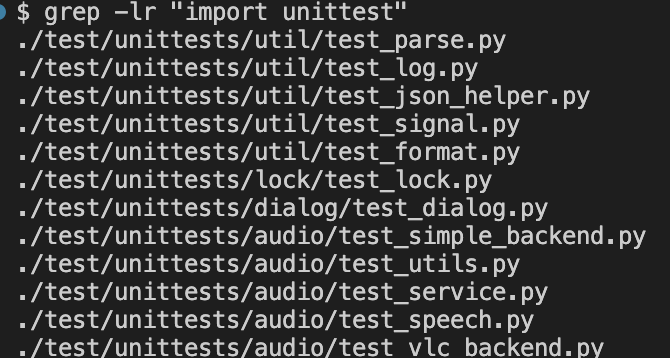
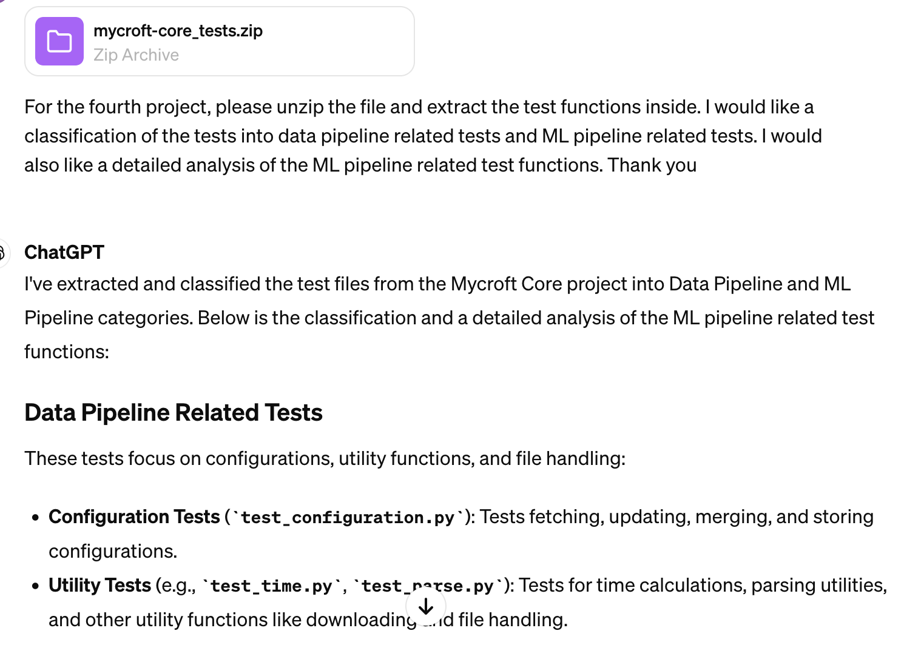
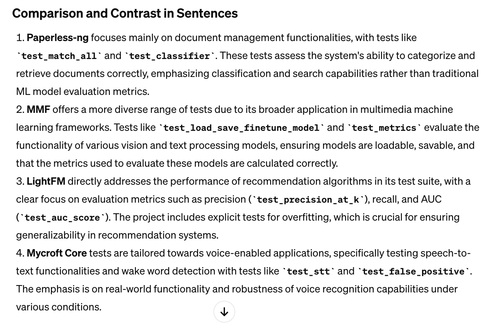
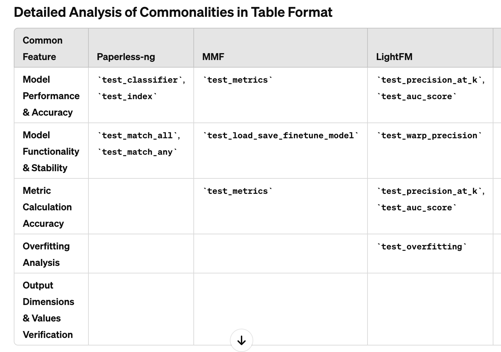
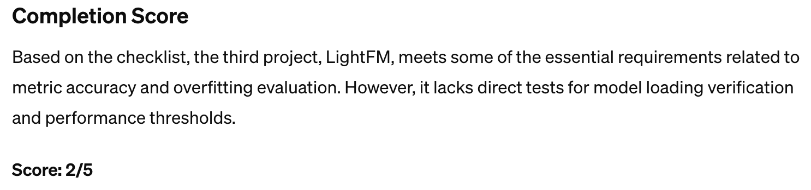
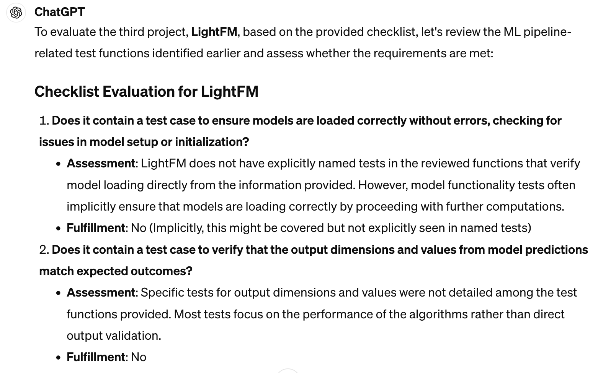

# How to analyze test functions from GitHub projects?

## Prerequisite

1. Locate the test functions in the repository, there are couple of ways to do that:

```
grep -lr "def test_"
grep -lr " unittest"
grep -lr " pytest"
...
```



2. Go to the directory containing the test functions, zip all file under it:

```
zip -r ../tests.zip *
```

## ChatGPT 4.0 Prompts for Analysis

### 1. Unzip and Classify into Data Pipeline and ML Pipeline

Upload the `tests.zip` and enter the prompt below for classification

```
Please unzip the file and extract the test functions inside. 
I would like a classification of the tests into data pipeline related tests and ML pipeline related tests. 
I would also like a detailed analysis of the ML pipeline related test functions.
```



### 2. Compare ML Pipeline Among N Projects

Repeat the step 1 for other projects
Enter the prompt below for summary among all projects

```
Compare and contrast the ML pipeline related test functions among all projects in sentences.
I would also like a detailed analysis of the commonalities of ML pipeline related test functions among all projects which highlights the corresponding test functions, in tabular format.
```



### 3. Generate Test Score and Reasons

Repeat the step 1 for the target project

Given the checklist for ML test, for example:
```
1. Does it contain test case to ensure models are loaded correctly without errors, checking for issues in model setup or initialization?
2. Does it contain test case to verify that the output dimensions and values from model predictions match expected outcomes?
3. Does it contain test case to confirm the accuracy and correctness of evaluation metrics used within the system, ensuring that metrics such as precision, recall, AUC, etc., are computed correctly?
4. Does it contain test case to evaluate the model’s performance over training to identify potential overfitting? This could involve comparing training and validation loss.
5. Does it contain test case to define and enforce performance thresholds for crucial metrics to guarantee model performance?
```

Enter the prompt below to obtain the test completeness score and the evaluation result for the target project

```
Based on the checklist below, evaluate whether the {target project} has fulfilled the requirements and deliver a completion score
{ML test checklist}
```


