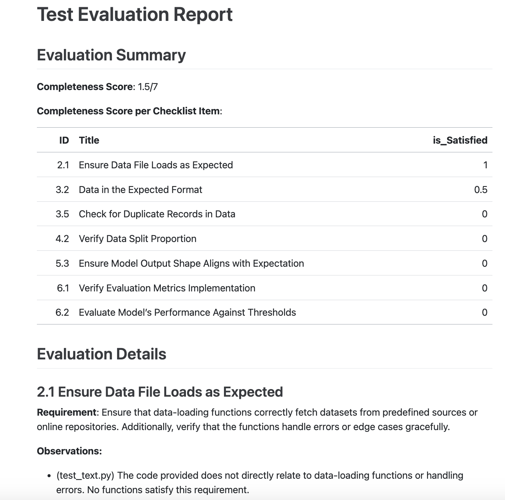

# Final Report - Checklists and LLM prompts for efficient and effective test creation in data analysis

by John Shiu, Orix Au Yeung, Tony Shum, Yingzi Jin

## Executive Summary

TBC

## Introduction

### Problem Statement

The global artificial intelligence (AI) market is growing exponentially {cite}`grand2021artificial`, driven by its ability to autonomously make complex decisions impacting various aspects of human life, including financial transactions, autonomous transportation, and medical diagnosis. 

However, ensuring the software quality of these systems remains a significant challenge {cite}`openja2023studying`. Specifically, the lack of a standardized and comprehensive approach to testing machine learning (ML) systems introduces potential risks to stakeholders. For example, inadequate quality assurance in ML systems can lead to severe consequences, such as substantial financial losses ({cite}`Asheeta2019`, {cite}`Asheeta2019`, {cite}`Asheeta2019`) and safety hazards. 

Therefore, defining and promoting an industry standard and establishing robust testing methodologies for these systems is crucial. But how?

### Our Objectives

We propose to develop testing suites diagnostic tools based on Large Language Models (LLMs) and curate a checklist to facilitate comprehensive testing of ML systems with flexibility. Our goal is to enhance applied ML software's trustworthiness, quality, and reproducibility across both the industry and academia {cite}`kapoor2022leakage`.

## Data Science Methods

### Other Approaches

### Our Approach

### Data
#### 1) ML Research Paper & Resources 

#### 2) GitHub Repositories
In this project, GitHub repositories are our data. 

To develop our testing checklist, we will collect 11 repositories studied in {cite}`openja2023studying`. Additionally, we will collect 377 repositories identified in the study by {cite}`wattanakriengkrai2022github` for our product development.

For each repository, we are interested in the metadata and the ML modeling- and test-related source code. The metadata will be retrieved using the GitHub API, while the source code will be downloaded and filtered using our custom scripts. To ensure the relevance of the repositories to our study, we will apply the following criteria for filtering:
 1. Repositories that are related to ML systems.
 2. Repositories that include test cases.
 3. Repositories whose development is written in the Python programming language.

### Success Metrics

1) Accuracy and Consistency of the Application Response vs Human Expert Judgement

{accuracy graph}

2) Our product's success will depend on mutation testing of the test functions developed based on our application-generated specifications. The evaluation metric is the success rate of detecting the perturbations introduced to the ML project code.

Our partners and stakeholders expect a significant improvement in the testing suites of their ML systems post-application usage. As a result, the testing suites will demonstrate high accuracy in detecting faults, ensuring consistency and high quality of ML projects during updates.

Our data science methodology incorporates human expert evaluation and prompt engineering to assess and enhance the test quality of ML systems.

- Human Expert Evaluation

    We will begin by formulating a comprehensive checklist for evaluating the data and ML pipeline based on the established testing strategies outlined in {cite}`openja2023studying` as the foundational framework. Based on the formulated checklist, our team will manually assess the test quality within each repository data. We will refine the checklist to ensure applicability and robustness when testing general ML systems.

- Prompt Engineering

    We will engineer the prompts for LLM to incorporate with the ML system code and the curated checklist and to serve various purposes across the three-stage process:
  
    1. Prompts to examine test cases within the ML system source codes and deliver test completeness scores.
    2. Prompts to compare and contrast the existing tests and the checklist and deliver recommendations.
    3. Prompts to generate system-specific test specifications based on user-selected testing recommendations {cite}`schafer2023empirical`

## Data Product & Results
### Data Products
Our solution offers an end-to-end application for evaluating and enhancing the robustness of users' ML systems.

One big challenge in utilizing LLMs to reliably and consistently evaluate ML systems is their tendency to generate illogical and/or factually wrong information known as hallucination {cite}`zhang2023sirens`.

To combat this, the system will incorporate a checklist ([Fig. 1](overview-diagram)) which would be curated manually and incorporate best practices in software testing and identified areas to be tested inside ML pipeline from human experts and past research.

This checklist will be our basis in evaluating the effectiveness and completeness of existing tests in a given codebase. Relevant information will be injected into a prompt template, which the LLMs would then be prompted to follow the checklist **exactly** during the evaluation.

Here is an example of how the checklist would be structured:

### Evaluation Artifacts

The end goal of our product is to generate the following three artifacts in relation to the evaluation of a given ML system codebase:

1. **ML Test Completeness Score**: The application utilizes LLMs and our curated checklist to analyze users' ML system source code and returns a comprehensive score of the system's test quality.
  
2. **Missing Test Recommendations**: The application evaluates the adequacy of existing tests for users' ML code and offers recommendations for additional, system-specific tests to enhance testing effectiveness.
  

3. **Test Function Specification Generation**: Users select desired test recommendations and prompt the application to generate test function specifications and references. These are reliable starting points for users to enrich the ML system test suites.

### Evaluation Results

## Conclusion

### Wrap Up

Our project, FixML, represents a significant step forward in the field of machine learning (ML) testing by providing tools that automate and enhance the evaluation and creation of test cases for ML models. The development and implementation of FixML have been driven by the need to address the limitations of traditional testing methods, which are often either too general or focus on quantitative metrics without testing the quality of ML or data science projects. FixML offers the advantages of combining the efficiency of automated testing with the thoroughness of expert evaluation, making it both scalable and reliable for diverse ML applications.

#### Key aspects of FixML

FixML seamlessly integrates with the user’s codebase, automatically analyzing the code and identifying existing test cases. This automated evaluation process leverages Large Language Models (LLMs) to assess the completeness and quality of existing tests, providing a comprehensive test completeness score. Additionally, FixML includes an automated test function specification generator that produces test function specifications based on checklist items, helping users create comprehensive test suites.

Efficiency and automation are central to FixML’s design. By automating the evaluation process, FixML significantly reduces the time and effort required to assess the quality of machine learning (ML) tests. This combination of automated testing and expert evaluation ensures thorough and efficient quality assessment.

Comprehensive reporting is another crucial aspect of FixML. The system generates detailed evaluation reports that include test completeness scores and specific recommendations for improvement. These reports provide actionable insights to enhance the quality and reliability of ML projects.

By focusing on seamless integration with codebases, automated evaluation and test generation, efficiency, flexibility, customization, and comprehensive reporting, FixML offers a robust, efficient, and customizable solution for evaluating and improving the testing quality of machine learning projects.

#### Limitation & Future Improvement

While FixML provides substantial benefits, there are limitations and areas that aim to be addressed in future development:

1. Workflow Optimization

The current test evaluator and test specification generator are separate entities. This could be improved by embedding a workflow engine that allows the system to automatically take actions based on the LLM response. For instance, if the LLM response suggests that test cases are partially satisfied or non-satisfied, the system could automatically run the test generator to produce test function skeletons and then reevaluate them until they are satisfied or some threshold is met. This would create a more cohesive and efficient workflow, reducing manual intervention and improving overall system performance.

2. Performance Optimization

Performance optimization is another critical area for future development. As FixML handles large codebases and complex evaluations, optimizing the system to handle these tasks more efficiently is essential. This includes improving the speed and accuracy of the LLM responses, reducing the time taken to analyze and generate reports, and ensuring the system can scale effectively to handle more extensive and more complex projects.

3. Specialized Checklist

The current checklist is designed to be general and may not cover all specific requirements for different ML projects. Future development will focus on creating more specialized checklists for different domains and project types, allowing for more tailored evaluations. Additionally, an interface will be provided to allow users to expand the checklists or select checklist items based on their specific needs, making the system more flexible and user-centric.

4. Enhanced Test Evaluator

The current evaluation relies on the capabilities of large language models (LLMs), which can vary in consistency and accuracy. Future improvements will enhance prompt engineering techniques and provide an interface that allows users to input their customized prompts into the system. This will improve the consistency and reliability of LLM responses. Additionally, expanding support for multiple LLMs will increase robustness and flexibility, ensuring that the system remains adaptable to advancements in LLM technology.

5. Customized Test Specification

The current generator produces general test function skeletons and does not integrate specific details for the projects. Future developments will focus on incorporating function specifications alongside checklists for more precise test generation. Additionally, integrating the project codebase as context for generating more detailed and customized test functions will make the tool more effective and aligned with the specific requirements of each project.

By addressing these limitations and focusing on these future improvements, FixML will become an even more powerful tool for ensuring the quality and robustness of machine learning and data science projects.

## Official Alpha Launch
As we move forward, we are excited to officially launch the alpha version of FixML. We invite you to test our tool, provide feedback, and collaborate with us to further refine and enhance its capabilities. Together, we can make a significant impact on the quality and reliability of machine learning projects across various domains.
